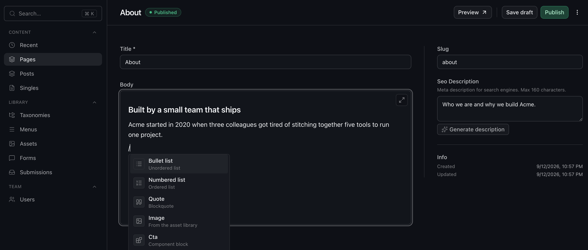

# Kide CMS

[](https://www.npmjs.com/package/@kidecms/core)
[](https://github.com/mhernesniemi/kide-cms/actions/workflows/ci.yml)
[](LICENSE)
[](https://astro.build)

A code-first CMS for Astro. Define collections in TypeScript and get a generated admin UI and typed content API.



- [Live demo](https://demo.kide.dev/admin)
- [Docs](https://docs.kide.dev/)

## Why Kide

**An Astro integration, not a headless service.** Kide lives in your repo: collections in TypeScript, content read through an import, the admin served by your own app, pages cached by Astro's route cache with tag invalidation.

**No plugin API.** You extend Kide the way you extend any code you own. Small needs are lifecycle hooks. Need more? `pnpm exec kide eject` moves the runtime, routes, and admin into `src/cms/` to read, change, and audit. Package mode when you want a dependency, embedded when you want the source.

**A complete admin for editors.** Your schema stays in TypeScript, and editors get:

- 16 field types, including Tiptap rich text, blocks, and relations
- Assets with folders, focal points, and on-demand optimization
- Live preview: edit in the admin, see the page
- Drafts, publishing, scheduling, and version restore
- Field-level i18n: translate only what needs it
- Role-based access control, review, and an audit trail

## Quick Start

```bash
pnpx create-kide-app
```

Pick how the runtime lives in your project:

- **Package** - the runtime is an `@kidecms/core` npm dependency in `node_modules`. Updates are a version bump.
- **Embedded** - the CMS runtime, admin UI, and routes sit in `src/cms/` as part of your project. Everything is there to read, debug, and change. Upgrades come as patches you review and apply yourself.

Pick a deploy target:

- **Node.js** - runs anywhere Node runs, SQLite for storage.
- **Cloudflare** - deploys as a Worker; provisions D1 + R2 for you.

## How It Works

Define collections in `src/cms/collections/`:

```ts
// src/cms/collections/posts.ts

export default defineCollection({
  slug: "posts",
  labels: { singular: "Post", plural: "Posts" },
  drafts: true,
  fields: {
    title: fields.text({ required: true, translatable: true }),
    body: fields.richText({ translatable: true }),
    author: fields.relation({ collection: "authors", admin: { position: "sidebar" } }),
  },
});
```

One config generates everything: Drizzle tables, TypeScript types, a Zod validator, and the runtime admin UI.

Query through the typed local API anywhere in server code:

```ts
import { cms } from "@/cms/.generated/api";

const posts = await cms.posts.find({ status: "published" });
const post = await cms.posts.create({ title: "Hello" });
```

Hook into the lifecycle to transform, validate, or invalidate cache:

```ts
posts: {
  afterPublish(doc, context) {
    context.cache?.invalidate({ tags: ["posts", `post:${doc._id}`] });
  },
}
```

## Stack

Astro 7, React 19, Drizzle ORM, SQLite/D1, Zod, Tiptap, shadcn/ui, Tailwind CSS

## Note

Kide is in **beta**: the config and collection API, the local API and the project-owned files are stable, and breaking changes to them land only in minor releases with a changelog note. See [Stability](https://docs.kide.dev/stability/).
